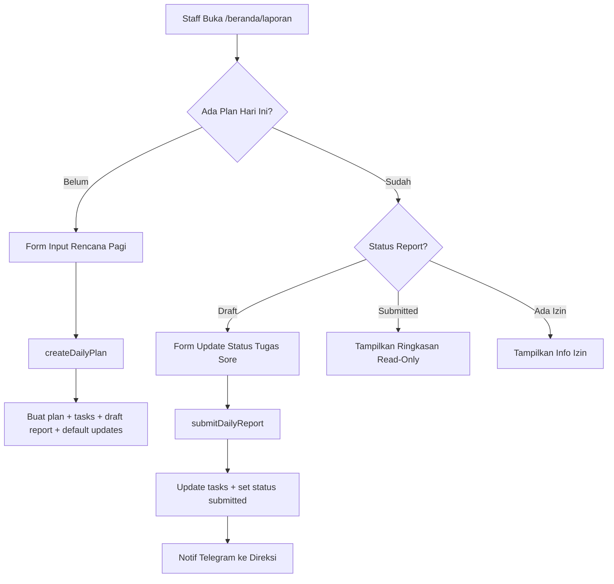
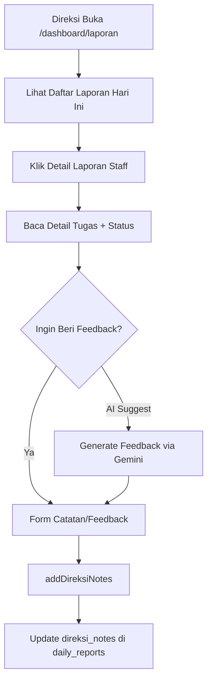
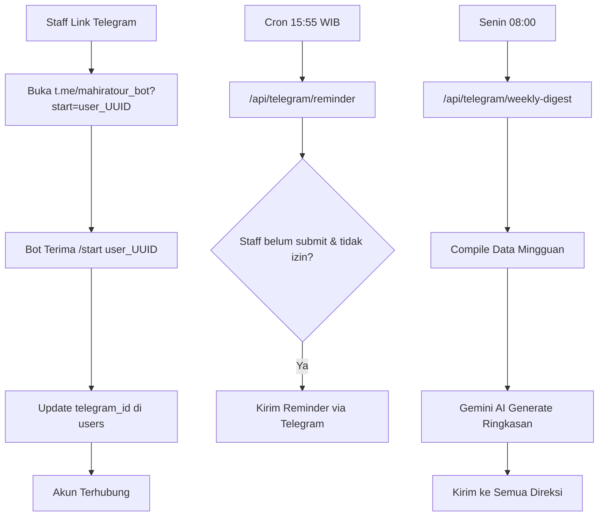
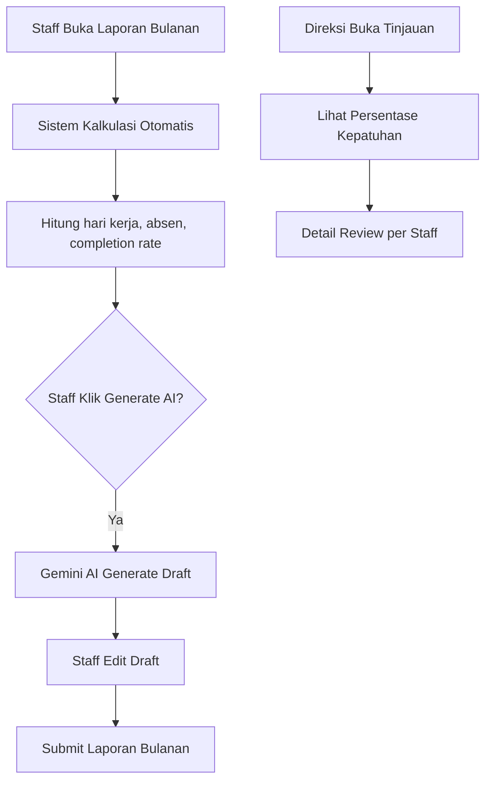

# 🔍 Analisis Komprehensif Sistem Mahira Tour

**Tanggal Review**: 25 Mei 2026  
**Deadline Magang**: 15 Juni 2026 (**20 hari tersisa**)  
**Reviewer**: AI System Analyst  
**Status**: ✅ **Database live sudah diverifikasi** (25 Mei 2026, 09:27 WIB)

---

## 📊 DAFTAR PRIORITAS KERJA (Tertinggi → Terendah)

### 🔴 PRIORITAS 1 — KRITIS (Harus segera, minggu ini)

| # | Item | Alasan | Estimasi |
|---|------|--------|----------|
| 1 | **🚨 Fix Bug: Schema Mismatch (TERKONFIRMASI)** — 4 kolom missing | `evidence_url`, `direksi_notes`, `plan_notes`, `notes` dipakai di kode tapi **TIDAK ADA di database live**. Submit foto, feedback direksi, dan search **PASTI GAGAL**. | 30 menit |
| 2 | **Fix Bug: Export CSV di Server Action** | `exportReportsToCSV()` menggunakan `document.createElement()` di server action (`'use server'`). Ini akan **CRASH** karena `document` tidak tersedia di server-side. | 1 jam |
| 3 | **Fix: Middleware proxy.ts** | File `src/proxy.ts` tidak terhubung ke `middleware.ts`. Tanpa ini, route guard **tidak berjalan** — siapa pun bisa mengakses `/dashboard` atau `/beranda` tanpa login dari URL langsung. | 30 menit |
| 4 | **Fix: Search Query Injection** | `searchReports()` dan `searchAllReports()` memasukkan input user langsung ke query `.or()` tanpa sanitization. Ini rentan **SQL/PostgREST injection**. | 1 jam |
| 5 | **Testing End-to-End di Production** | Semua fitur harus ditest di Vercel production, bukan hanya di `localhost`. Pastikan semua env vars benar. | 3-4 jam |

---

### 🟠 PRIORITAS 2 — PENTING (Minggu ini - minggu depan)

| # | Item | Alasan | Estimasi |
|---|------|--------|----------|
| 6 | **UI/UX Polishing** | Sudah ada plan di `IMPLEMENTATION_PLAN_UI_POLISHING.md`. Light/Dark mode + migrasi font + hardcoded colors. | 4-5 jam |
| 7 | **Keamanan: Role Check di Server Actions** | Beberapa server action (misal `createAbsence`, `deleteAbsence`) hanya cek `auth` tapi **tidak cek role**. Staff seharusnya tidak bisa akses action tertentu milik direksi. | 2 jam |
| 8 | **Keamanan: API Route Protection** | API endpoint `/api/telegram/reminder`, `/api/telegram/weekly-digest`, dan `/api/keep-alive` hanya dilindungi oleh query param `secret`. Secret ini ada di `PROGRESS.md` yang **ter-commit di Git**! | 1 jam |
| 9 | **Code Cleanup** | Hapus `console.log` yang tidak perlu di production, hapus file test. | 1 jam |
| 10 | **Date/Timezone Bug** | Banyak penggunaan `new Date().toISOString().split('T')[0]` yang menghasilkan tanggal dalam **UTC**, bukan WIB. Ini bisa menyebabkan laporan "hari ini" salah saat sore/malam (UTC+0 vs UTC+7). | 2 jam |

---

### 🟡 PRIORITAS 3 — SEDANG (Sebelum deadline)

| # | Item | Alasan | Estimasi |
|---|------|--------|----------|
| 11 | **User Guide / Panduan Penggunaan** | Wajib ada untuk serah terima. Buat guide untuk staff dan direksi. | 4-5 jam |
| 12 | **Dokumentasi Teknis** | Arsitektur, API endpoints, deployment guide. Penting untuk handover. | 3-4 jam |
| 13 | **Error Handling yang Lebih Baik** | Beberapa action mengembalikan `{ error: error.message }` yang terlalu teknis untuk user. Perlu user-friendly error messages. | 2 jam |
| 14 | **Perbaikan Rollback di `createDailyPlan`** | Rollback manual (`delete` setelah error) tidak atomic — bisa gagal juga. Idealnya pakai database transaction via RPC. | 2 jam |

---

### 🟢 PRIORITAS 4 — RENDAH (Nice-to-have sebelum deadline)

| # | Item | Alasan | Estimasi |
|---|------|--------|----------|
| 15 | **Laporan Akhir Magang** | Rangkuman project & kontribusi | 4-5 jam |
| 16 | **Presentasi / Demo** | Slide + demo skenario | 3-4 jam |
| 17 | **Serah Terima** | Handover ke tim/pembimbing | 2 jam |
| 18 | **Accessibility (a11y)** | ARIA labels, keyboard navigation, screen reader support | 3 jam |
| 19 | **Performance Optimization** | Lazy loading, optimistic UI, pagination untuk data besar | 3 jam |

---

## 🔄 REVIEW ALUR / FLOW SISTEM

### Flow 1: Autentikasi & Routing

```mermaid
graph TD
    A[User Buka App] --> B{Login?}
    B -->|Belum| C[Redirect ke /login]
    B -->|Sudah| D{Cek Role}
    D -->|Direksi| E[/dashboard]
    D -->|Staff| F[/beranda]
    C --> G[Input Email + Password]
    G --> H[loginAction]
    H --> I{Berhasil?}
    I -->|Ya| D
    I -->|Tidak| J[Tampilkan Error]
```

> [!CAUTION]
> **Masalah Kritis**: File `src/proxy.ts` berisi middleware logic yang benar, tapi **tidak ada file `middleware.ts`** di root project yang menghubungkannya. Artinya:
> - Route guard **TIDAK AKTIF**
> - Siapa pun bisa langsung akses `/dashboard` atau `/beranda` dari URL tanpa login
> - Hanya page-level `redirect('/login')` yang melindungi, tapi ini tidak optimal
>
> **Solusi**: Buat file `src/middleware.ts` yang meng-export `proxy` sebagai default middleware.

---

### Flow 2: Laporan Harian (Core Business Flow)



> [!WARNING]
> **Masalah pada `createDailyPlan`**:
> 1. **Bukan atomic transaction** — Insert plan, lalu tasks, lalu report, lalu updates. Jika step 3 gagal, hanya plan yang di-rollback, tapi tasks sudah orphan.
> 2. **Timezone issue** — `new Date().toISOString().split('T')[0]` menghasilkan tanggal UTC. Pada jam 00:00-06:59 WIB (yang masih hari sebelumnya di UTC), staff bisa membuat plan untuk "hari kemarin" di UTC.
>
> **Solusi**:
> 1. Buat Supabase RPC function yang menjalankan semua insert dalam satu transaction.
> 2. Gunakan timezone-aware date: `new Date().toLocaleDateString('sv-SE', { timeZone: 'Asia/Jakarta' })`

---

### Flow 3: Direksi Review Laporan



> [!CAUTION]
> **TERKONFIRMASI dari database live (25 Mei 2026)**: Tabel `daily_reports` hanya punya **9 kolom**. Field berikut **TIDAK ADA** di database:
> - `direksi_notes` — dipakai di `report.ts:L231`, `search-client.tsx`, `laporan/[id]/page.tsx`
> - `evidence_url` — dipakai di `report.ts:L150`, `laporan/page.tsx`, `laporan/[id]/page.tsx`
> - `plan_notes` — dipakai di `search.ts` query `.or()`
> - `notes` — dipakai di `search.ts` query `.or()`
>
> **Solusi**: Jalankan SQL ini di Supabase SQL Editor:
> ```sql
> ALTER TABLE daily_reports ADD COLUMN direksi_notes TEXT;
> ALTER TABLE daily_reports ADD COLUMN evidence_url TEXT;
> ```
> Untuk `plan_notes` dan `notes`: hapus dari query search karena tidak relevan (data ada di `plan_tasks` dan `task_updates`).

---

### Flow 4: Telegram Bot Integration



> [!WARNING]
> **Masalah Keamanan Token Telegram**:
> - Bot token ter-expose di `PROGRESS.md:L23` yang ada di Git repository
> - Webhook secret juga ter-expose
> - Siapa pun yang melihat repo bisa mengendalikan bot
>
> **Solusi**:
> 1. Hapus semua secret/token dari file markdown
> 2. Regenerate bot token via BotFather (`/revoke`)
> 3. Gunakan `.env.local` yang sudah ada di `.gitignore`

> [!NOTE]
> **Masalah Minor pada `/izin` command**: Perhitungan `endOfMonth` menggunakan hardcoded `-31` yang salah untuk bulan Februari (28/29), April (30), Juni (30), dll. Ini tidak akan crash karena PostgreSQL akan handle tanggal yang tidak exist, tapi lebih baik gunakan `new Date(year, month, 0).getDate()` untuk mendapatkan hari terakhir bulan yang benar.

---

### Flow 5: Laporan Bulanan + AI



> [!NOTE]
> **Flow ini sudah cukup baik.** Satu catatan: tidak ada validasi apakah staff sudah submit semua daily report sebelum bisa submit monthly report. Ini bisa jadi fitur nice-to-have.

---

## 🐛 TEMUAN BUG & KESALAHAN SPESIFIK

### Bug #1: `exportReportsToCSV` Crash di Server
**File**: `src/actions/search.ts:L272-L278`

```typescript
// ❌ MASALAH: Kode ini ada di 'use server' tapi menggunakan browser API
const blob = new Blob([csvContent], { type: 'text/csv;charset=utf-8;' })
const link = document.createElement('a')  // ← document tidak ada di server!
```

**Solusi**: Pindahkan download logic ke client-side. Server action hanya return CSV string:
```typescript
// Server action: return CSV data
export async function generateCSVData(filters: SearchFilters, isDireksi = false) {
  // ... build csvContent ...
  return { data: csvContent }
}

// Client component: handle download
function downloadCSV(csvContent: string) {
  const blob = new Blob([csvContent], { type: 'text/csv;charset=utf-8;' })
  const link = document.createElement('a')
  // ... download logic ...
}
```

---

### Bug #2: Search Query Injection
**File**: `src/actions/search.ts:L43-L46`

```typescript
// ❌ MASALAH: User input langsung masuk ke query filter
query = query.or(`
  plan_notes.ilike.%${filters.search}%,
  notes.ilike.%${filters.search}%
`)
```

Jika user memasukkan karakter khusus seperti `%`, `_`, atau bahkan `)`, ini bisa merusak query atau bypass filter.

**Solusi**: Escape karakter khusus:
```typescript
const escaped = filters.search.replace(/[%_]/g, '\\$&')
query = query.or(`plan_notes.ilike.%${escaped}%,notes.ilike.%${escaped}%`)
```

---

### Bug #3: `searchAllReports` Division Filter Tidak Bekerja
**File**: `src/actions/search.ts:L203`

```typescript
// ❌ MASALAH: Filter pada relasi nested tidak didukung oleh .eq() PostgREST
query = query.eq('users.division_id', parseInt(filters.division_id))
```

Supabase/PostgREST tidak support filtering pada tabel yang di-join via `select()` dengan `.eq()` pada kolom relasi seperti `users.division_id`. Ini akan silently fail (tidak filter apa-apa).

**Solusi**: Filter langsung pada kolom `division_id` yang ada di tabel `daily_reports`:
```typescript
query = query.eq('division_id', parseInt(filters.division_id))
```

---

### Bug #4: Date Calculation Bug di Weekly Digest
**File**: `src/app/api/telegram/weekly-digest/route.ts:L17`

```typescript
lastMonday.setDate(now.getDate() - now.getDay() - 6) // Previous Monday
```

Perhitungan ini salah jika hari ini Minggu (`getDay() = 0`): `date - 0 - 6 = date - 6` → menunjuk ke **Selasa minggu lalu**, bukan Senin.

**Solusi**: Gunakan library `date-fns` (sudah terinstall!):
```typescript
import { startOfWeek, subWeeks, addDays } from 'date-fns'
const lastMonday = startOfWeek(subWeeks(new Date(), 1), { weekStartsOn: 1 })
const lastFriday = addDays(lastMonday, 4)
```

---

### Bug #5: Timezone Mismatch Seluruh Aplikasi
**File**: Multiple files

Semua penggunaan `new Date().toISOString().split('T')[0]` akan menghasilkan **tanggal UTC**. Indonesia adalah **UTC+7**. Ini berarti:

| Waktu WIB | UTC | Tanggal WIB | Tanggal UTC (yang dipakai) |
|-----------|-----|-------------|---------------------------|
| 00:00 - 06:59 WIB | 17:00 - 23:59 UTC (hari sebelumnya) | 26 Mei | **25 Mei** ❌ |
| 07:00 - 23:59 WIB | 00:00 - 16:59 UTC | 26 Mei | 26 Mei ✅ |

Staff yang membuat rencana pagi jam 05:00-06:59 WIB akan tercatat di tanggal **kemarin**.

**Solusi Global**: Buat utility function:
```typescript
// src/lib/utils.ts
export function getTodayWIB(): string {
  return new Date().toLocaleDateString('sv-SE', { timeZone: 'Asia/Jakarta' })
  // Output: 'YYYY-MM-DD' dalam zona WIB
}
```
Kemudian ganti semua `new Date().toISOString().split('T')[0]` dengan `getTodayWIB()`.

---

### Bug #6: `addDireksiNotes` Tidak Cek Keberadaan Report
**File**: `src/actions/report.ts:L212-L238`

Action ini langsung update tanpa validasi apakah `reportId` valid. Jika ID tidak exist, Supabase akan return success tanpa error (0 rows affected).

**Solusi**: Tambahkan validasi:
```typescript
const { data: report, error: fetchError } = await supabase
  .from('daily_reports')
  .select('id')
  .eq('id', reportId)
  .single()

if (!report) return { error: 'Laporan tidak ditemukan' }
```

---

## 📦 DATABASE LIVE vs KODE (Verified 25 Mei 2026)

### Tabel yang Ada di Database Live (14 tabel)

| # | Tabel | Kolom | Status |
|---|-------|-------|--------|
| 1 | `users` | 8 kolom | ✅ Sinkron |
| 2 | `divisions` | 4 kolom | ✅ Sinkron |
| 3 | `absences` | 6 kolom | ✅ Sinkron |
| 4 | `announcements` | 6 kolom | ✅ Sinkron |
| 5 | `announcement_reads` | 4 kolom | ✅ Sinkron |
| 6 | `daily_work_plans` | 5 kolom | ✅ Sinkron |
| 7 | `plan_tasks` | 6 kolom | ✅ Sinkron |
| 8 | `daily_reports` | 9 kolom | 🔴 **Missing: evidence_url, direksi_notes** |
| 9 | `task_updates` | 5 kolom | ✅ Sinkron |
| 10 | `report_attachments` | 6 kolom | ✅ Sinkron |
| 11 | `report_notes` | 5 kolom | ✅ Sinkron |
| 12 | `division_documents` | 11 kolom | ✅ Sinkron |
| 13 | `monthly_reports` | 11 kolom | ✅ Sinkron |
| 14 | `division_files` | 9 kolom | ⚠️ **Tidak ada di schema file, kemungkinan tabel lama** |

### SQL Fix yang Harus Dijalankan

```sql
-- Fix #1: Tambah kolom yang missing di daily_reports
ALTER TABLE daily_reports ADD COLUMN IF NOT EXISTS evidence_url TEXT;
ALTER TABLE daily_reports ADD COLUMN IF NOT EXISTS direksi_notes TEXT;

-- Fix #2: (Opsional) Hapus tabel lama jika sudah tidak dipakai
-- DROP TABLE IF EXISTS division_files;
```

---

## 🏗️ REVIEW ARSITEKTUR & DESIGN

### ✅ Yang Sudah Baik
1. **Pemisahan role via route groups** (`(staff)` vs `(direksi)`) — pattern yang tepat
2. **RLS (Row Level Security)** — implementasi cukup komprehensif
3. **Server Actions** — penggunaan `'use server'` sudah benar
4. **Error Boundaries** — sudah ada `error.tsx` dan `global-error.tsx`
5. **Non-blocking notification** — notif Telegram di-fire tanpa blocking response
6. **Admin client separation** — `admin.ts` terpisah dari `server.ts`
7. **Type safety** — `types.ts` mendefinisikan semua interface dengan baik

### ⚠️ Yang Perlu Diperbaiki

#### 1. Tidak Ada Middleware Aktif
Middleware adalah **garis pertahanan pertama** untuk auth & routing. Saat ini `proxy.ts` ada tapi tidak terhubung.

#### 2. Duplikasi Kode di Search
`searchReports()` dan `searchAllReports()` di `src/actions/search.ts` memiliki ~80% kode yang sama (date range logic). Ini violasi DRY principle.

**Solusi**: Extract fungsi `applyDateFilter(query, filters)` yang reusable.

#### 3. Hardcoded Colors di CSS dan Komponen
`src/app/globals.css` dan `src/app/(direksi)/dashboard/page.tsx` masih menggunakan hardcoded hex (`#e8e6e3`, `#737068`) dan Tailwind `slate-*` classes. Ini akan bermasalah saat implementasi light/dark mode.

#### 4. Tidak Ada Input Validation Layer
Semua validasi dilakukan secara ad-hoc di setiap action. Tidak ada shared validation utility/schema (misal Zod).

#### 5. Secret Exposure di Repository
Credential sensitif di `PROGRESS.md` — bot token, webhook secret, webhook URL — semuanya ter-commit di Git.

---

## 📋 TIMELINE REKOMENDASI (20 hari tersisa)

### Minggu 1 (26-30 Mei): Fix Bugs & Security
| Hari | Task |
|------|------|
| Sen | Fix middleware, schema mismatch, search injection |
| Sel | Fix CSV export, timezone utility, date bugs |
| Rab | UI Polishing — Font Inter + CSS variables |
| Kam | UI Polishing — Migrasi hardcoded colors |
| Jum | UI Polishing — Dark/Light toggle + testing |

### Minggu 2 (2-6 Juni): Documentation & Testing
| Hari | Task |
|------|------|
| Sen | End-to-end testing production |
| Sel | Fix bugs from testing |
| Rab | User Guide (staff) |
| Kam | User Guide (direksi) + Dokumentasi Teknis |
| Jum | Code cleanup + remove secrets from Git |

### Minggu 3 (9-13 Juni): Finalisasi
| Hari | Task |
|------|------|
| Sen | Laporan Akhir Magang |
| Sel | Presentasi / Slide |
| Rab | Demo rehearsal |
| Kam | Buffer / fix last-minute issues |
| Jum | Serah terima |

---

## 🎯 SKOR KESIAPAN SISTEM

| Aspek | Skor | Keterangan |
|-------|------|------------|
| **Fitur Fungsional** | 🟢 9/10 | Hampir semua fitur sudah selesai & bekerja |
| **Keamanan** | 🟠 5/10 | Middleware tidak aktif, secret di Git, no input sanitization |
| **Stabilitas** | 🟡 6/10 | Ada beberapa bug (CSV, timezone, schema mismatch) |
| **UI/UX** | 🟡 6/10 | Fungsional tapi masih hardcoded dark mode, perlu polish |
| **Dokumentasi** | 🔴 3/10 | Belum ada user guide dan dokumentasi teknis |
| **Production Readiness** | 🟡 6/10 | Sudah deploy tapi belum fully tested |
| **Code Quality** | 🟡 7/10 | Cukup rapi tapi ada duplikasi & cleanup needed |

**Skor Keseluruhan: 6/10** — Sistem fungsional dan impresif secara fitur, tapi perlu perbaikan keamanan dan stabilitas sebelum demo.

---

> [!TIP]
> **Strategi Prioritas**: Fokus perbaiki **Bug #1-5** terlebih dahulu karena ini bisa menyebabkan error saat demo. Kemudian lanjut UI polishing, lalu dokumentasi. Jangan terlalu ambisius menambah fitur baru — fokus pada stabilitas dan presentabilitas.

---

*Dokumen ini di-generate pada 25 Mei 2026 berdasarkan review kode, schema database, alur bisnis, keamanan, dan arsitektur.*
