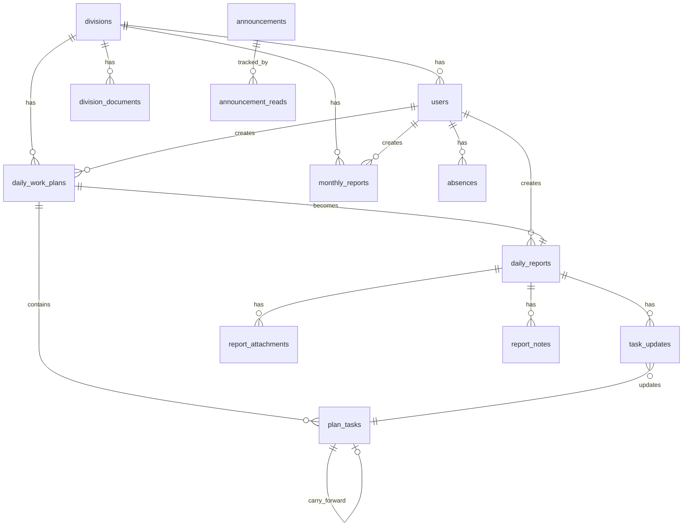

# 🏗️ Blueprint — Sistem Laporan Terintegrasi Mahira Tour

> **Versi**: 1.0  
> **Tanggal**: 28 April 2026  
> **Domain**: `laporan.mahiratour.id`  
> **Stack**: Next.js 15 + Supabase + shadcn/ui  
> **Timeline**: 4 minggu

---

## 1. Arsitektur Sistem

```
┌──────────────────────────────────────────────────────────────┐
│  USER (HP / Laptop)                                          │
│  └─→ laporan.mahiratour.id                                   │
└──────────────┬───────────────────────────────────────────────┘
               │ HTTPS
┌──────────────▼───────────────────────────────────────────────┐
│  VERCEL (Hosting — Free)                                     │
│  ├── Next.js 15 App Router                                   │
│  ├── Server Components (render halaman)                      │
│  ├── Server Actions (form submit langsung ke DB)             │
│  └── API Routes (webhook Telegram)                           │
└──────────────┬───────────────────────────────────────────────┘
               │
┌──────────────▼───────────────────────────────────────────────┐
│  SUPABASE (Backend — Free Tier)                              │
│  ├── Auth         → Login, session, role                     │
│  ├── PostgreSQL   → Semua data (500 MB free)                 │
│  ├── Storage      → Foto bukti & arsip dokumen (1 GB free)  │
│  ├── RLS          → Akses kontrol per role                   │
│  ├── Edge Func    → Cron reminder Telegram                   │
│  └── Realtime     → Live update dashboard (opsional)         │
└──────────────────────────────────────────────────────────────┘
               │
┌──────────────▼───────────────────────────────────────────────┐
│  TELEGRAM BOT API (Notifikasi — Gratis)                      │
│  ├── Reminder harian jam 16:00 WIB                           │
│  └── Weekly digest Senin pagi                                │
└──────────────────────────────────────────────────────────────┘

EXTERNAL CRON (cron-job.org — Gratis)
  └── Ping DB setiap 3 hari → mencegah pausing free tier
```

---

## 2. Database Schema

### 2.1 Tabel: `divisions`

```sql
CREATE TABLE divisions (
  id          SERIAL PRIMARY KEY,
  name        TEXT NOT NULL UNIQUE,
  description TEXT,
  created_at  TIMESTAMPTZ DEFAULT now()
);
```

### 2.2 Tabel: `users` (extend Supabase Auth)

```sql
CREATE TABLE users (
  id            UUID PRIMARY KEY REFERENCES auth.users(id) ON DELETE CASCADE,
  full_name     TEXT NOT NULL,
  email         TEXT NOT NULL UNIQUE,
  role          TEXT NOT NULL CHECK (role IN ('staff', 'direksi')),
  division_id   INT REFERENCES divisions(id),
  telegram_id   TEXT,
  is_active     BOOLEAN DEFAULT true,
  created_at    TIMESTAMPTZ DEFAULT now()
);

-- Auto-create user row saat register
CREATE OR REPLACE FUNCTION handle_new_user()
RETURNS TRIGGER AS $$
BEGIN
  INSERT INTO public.users (id, email, full_name, role)
  VALUES (NEW.id, NEW.email, '', 'staff');
  RETURN NEW;
END;
$$ LANGUAGE plpgsql SECURITY DEFINER;

CREATE TRIGGER on_auth_user_created
  AFTER INSERT ON auth.users
  FOR EACH ROW EXECUTE FUNCTION handle_new_user();
```

### 2.3 Tabel: `daily_work_plans` (Rencana Kerja Pagi)

```sql
CREATE TABLE daily_work_plans (
  id            SERIAL PRIMARY KEY,
  user_id       UUID NOT NULL REFERENCES users(id),
  division_id   INT NOT NULL REFERENCES divisions(id),
  plan_date     DATE NOT NULL,
  created_at    TIMESTAMPTZ DEFAULT now(),
  UNIQUE(user_id, plan_date)
);
```

### 2.4 Tabel: `plan_tasks` (Task dalam Rencana)

```sql
CREATE TABLE plan_tasks (
  id              SERIAL PRIMARY KEY,
  plan_id         INT NOT NULL REFERENCES daily_work_plans(id) ON DELETE CASCADE,
  title           TEXT NOT NULL,
  priority        TEXT DEFAULT 'sedang' CHECK (priority IN ('tinggi', 'sedang', 'rendah')),
  source_task_id  INT REFERENCES plan_tasks(id),  -- carry-forward dari kemarin
  created_at      TIMESTAMPTZ DEFAULT now()
);
```

### 2.5 Tabel: `daily_reports` (Laporan Sore)

```sql
CREATE TABLE daily_reports (
  id            SERIAL PRIMARY KEY,
  plan_id       INT NOT NULL REFERENCES daily_work_plans(id) UNIQUE,
  user_id       UUID NOT NULL REFERENCES users(id),
  division_id   INT NOT NULL REFERENCES divisions(id),
  report_date   DATE NOT NULL,
  status        TEXT DEFAULT 'draft' CHECK (status IN ('draft', 'submitted', 'acknowledged')),
  submitted_at  TIMESTAMPTZ,
  acknowledged_by UUID REFERENCES users(id),
  acknowledged_at TIMESTAMPTZ
);
```

### 2.6 Tabel: `task_updates` (Update Status Task)

```sql
CREATE TABLE task_updates (
  id                SERIAL PRIMARY KEY,
  report_id         INT NOT NULL REFERENCES daily_reports(id) ON DELETE CASCADE,
  plan_task_id      INT NOT NULL REFERENCES plan_tasks(id),
  completion_status TEXT NOT NULL CHECK (completion_status IN ('selesai', 'dalam_proses', 'tidak_selesai', 'dibatalkan')),
  notes             TEXT,
  UNIQUE(report_id, plan_task_id)
);
```

### 2.7 Tabel: `report_attachments` (Foto Bukti)

```sql
CREATE TABLE report_attachments (
  id          SERIAL PRIMARY KEY,
  report_id   INT REFERENCES daily_reports(id) ON DELETE CASCADE,
  file_path   TEXT NOT NULL,
  file_size   INT,
  file_type   TEXT,
  uploaded_at TIMESTAMPTZ DEFAULT now()
);
```

### 2.8 Tabel: `report_notes` (Catatan Pimpinan)

```sql
CREATE TABLE report_notes (
  id          SERIAL PRIMARY KEY,
  report_id   INT NOT NULL REFERENCES daily_reports(id) ON DELETE CASCADE,
  noted_by    UUID NOT NULL REFERENCES users(id),
  content     TEXT NOT NULL,
  created_at  TIMESTAMPTZ DEFAULT now()
);
```

### 2.9 Tabel: `absences` (Izin/Ketidakhadiran)

```sql
CREATE TABLE absences (
  id            SERIAL PRIMARY KEY,
  user_id       UUID NOT NULL REFERENCES users(id),
  absence_date  DATE NOT NULL,
  type          TEXT NOT NULL CHECK (type IN ('sakit', 'cuti', 'dinas_luar', 'lainnya')),
  reason        TEXT,
  created_at    TIMESTAMPTZ DEFAULT now(),
  UNIQUE(user_id, absence_date)
);
```

### 2.10 Tabel: `division_documents` (Arsip Dokumen)

```sql
CREATE TABLE division_documents (
  id            SERIAL PRIMARY KEY,
  division_id   INT NOT NULL REFERENCES divisions(id),
  uploaded_by   UUID NOT NULL REFERENCES users(id),
  title         TEXT NOT NULL,
  category      TEXT DEFAULT 'lainnya' CHECK (category IN ('sop', 'kontrak', 'laporan', 'template', 'lainnya')),
  file_path     TEXT NOT NULL,
  file_size     INT,
  file_type     TEXT,
  description   TEXT,
  is_pinned     BOOLEAN DEFAULT false,
  created_at    TIMESTAMPTZ DEFAULT now()
);
```

### 2.11 Tabel: `announcements` (Pengumuman)

```sql
CREATE TABLE announcements (
  id                  SERIAL PRIMARY KEY,
  created_by          UUID NOT NULL REFERENCES users(id),
  title               TEXT NOT NULL,
  content             TEXT NOT NULL,
  target_division_id  INT REFERENCES divisions(id),  -- NULL = semua divisi
  created_at          TIMESTAMPTZ DEFAULT now()
);
```

### 2.12 Tabel: `announcement_reads` (Status Baca)

```sql
CREATE TABLE announcement_reads (
  id              SERIAL PRIMARY KEY,
  announcement_id INT NOT NULL REFERENCES announcements(id) ON DELETE CASCADE,
  user_id         UUID NOT NULL REFERENCES users(id),
  read_at         TIMESTAMPTZ DEFAULT now(),
  UNIQUE(announcement_id, user_id)
);
```

### 2.13 Tabel: `monthly_reports` (Laporan Bulanan)

```sql
CREATE TABLE monthly_reports (
  id                  SERIAL PRIMARY KEY,
  user_id             UUID NOT NULL REFERENCES users(id),
  division_id         INT NOT NULL REFERENCES divisions(id),
  month               INT NOT NULL CHECK (month BETWEEN 1 AND 12),
  year                INT NOT NULL,
  auto_generated_data JSONB,       -- rekap otomatis dari data harian
  achievements        TEXT,        -- narasi capaian
  challenges          TEXT,        -- narasi kendala
  next_month_plan     TEXT,        -- rencana bulan depan
  status              TEXT DEFAULT 'draft' CHECK (status IN ('draft', 'submitted', 'acknowledged')),
  submitted_at        TIMESTAMPTZ,
  created_at          TIMESTAMPTZ DEFAULT now(),
  UNIQUE(user_id, month, year)
);
```

### 2.14 Diagram Relasi



---

## 3. Indexes (Performa)

```sql
-- Query utama: laporan per user per tanggal
CREATE INDEX idx_plans_user_date ON daily_work_plans(user_id, plan_date);
CREATE INDEX idx_plans_division_date ON daily_work_plans(division_id, plan_date);
CREATE INDEX idx_reports_status ON daily_reports(status);
CREATE INDEX idx_reports_date ON daily_reports(report_date);

-- Arsip dokumen
CREATE INDEX idx_docs_division ON division_documents(division_id);

-- Pengumuman
CREATE INDEX idx_announcements_target ON announcements(target_division_id);

-- Izin
CREATE INDEX idx_absences_user_date ON absences(user_id, absence_date);

-- Full-text search di task
CREATE EXTENSION IF NOT EXISTS pg_trgm;
CREATE INDEX idx_tasks_title_trgm ON plan_tasks USING gin(title gin_trgm_ops);
```

---

## 4. RLS Policies

```sql
-- Enable RLS di semua tabel
ALTER TABLE users ENABLE ROW LEVEL SECURITY;
ALTER TABLE daily_work_plans ENABLE ROW LEVEL SECURITY;
ALTER TABLE daily_reports ENABLE ROW LEVEL SECURITY;
ALTER TABLE division_documents ENABLE ROW LEVEL SECURITY;
ALTER TABLE announcements ENABLE ROW LEVEL SECURITY;
ALTER TABLE absences ENABLE ROW LEVEL SECURITY;

-- Helper function: cek role user
CREATE OR REPLACE FUNCTION get_user_role()
RETURNS TEXT AS $$
  SELECT role FROM users WHERE id = auth.uid();
$$ LANGUAGE sql SECURITY DEFINER;

CREATE OR REPLACE FUNCTION get_user_division()
RETURNS INT AS $$
  SELECT division_id FROM users WHERE id = auth.uid();
$$ LANGUAGE sql SECURITY DEFINER;

-- Contoh policy: daily_reports
CREATE POLICY "Staff lihat laporan divisi sendiri"
  ON daily_reports FOR SELECT
  USING (division_id = get_user_division() OR get_user_role() = 'direksi');

CREATE POLICY "Staff buat laporan sendiri"
  ON daily_reports FOR INSERT
  WITH CHECK (user_id = auth.uid());

CREATE POLICY "Direksi lihat semua"
  ON daily_reports FOR SELECT
  USING (get_user_role() = 'direksi');

-- Contoh policy: division_documents
CREATE POLICY "Staff akses arsip divisi sendiri"
  ON division_documents FOR SELECT
  USING (division_id = get_user_division() OR get_user_role() = 'direksi');

CREATE POLICY "Staff upload ke divisi sendiri"
  ON division_documents FOR INSERT
  WITH CHECK (division_id = get_user_division());

-- Contoh policy: announcements
CREATE POLICY "Semua bisa baca pengumuman"
  ON announcements FOR SELECT
  USING (target_division_id IS NULL OR target_division_id = get_user_division() OR get_user_role() = 'direksi');

CREATE POLICY "Hanya direksi buat pengumuman"
  ON announcements FOR INSERT
  WITH CHECK (get_user_role() = 'direksi');
```

---

## 5. Storage Buckets

```sql
-- Bucket untuk foto bukti laporan
INSERT INTO storage.buckets (id, name, public) VALUES ('report-photos', 'report-photos', false);

-- Bucket untuk arsip dokumen divisi
INSERT INTO storage.buckets (id, name, public) VALUES ('division-docs', 'division-docs', false);

-- Policy: user hanya upload ke folder divisinya
CREATE POLICY "Upload foto laporan" ON storage.objects FOR INSERT
  WITH CHECK (bucket_id = 'report-photos' AND auth.uid() IS NOT NULL);

CREATE POLICY "Upload dokumen divisi" ON storage.objects FOR INSERT
  WITH CHECK (bucket_id = 'division-docs' AND auth.uid() IS NOT NULL);
```

**Konfigurasi upload:**
- Foto laporan: max 200KB, format WebP/JPEG, compress client-side
- Dokumen arsip: max 5MB, format PDF/XLSX/DOCX/JPG/PNG

---

## 6. Struktur Project Next.js

```
src/
├── app/
│   ├── layout.tsx                    ← Root layout + font + metadata
│   ├── page.tsx                      ← Redirect ke login atau dashboard
│   │
│   ├── (auth)/
│   │   ├── login/page.tsx            ← Form login
│   │   └── layout.tsx                ← Auth layout (tanpa sidebar)
│   │
│   ├── (staff)/
│   │   ├── layout.tsx                ← Staff layout (sidebar + header)
│   │   ├── beranda/page.tsx          ← Pengumuman + status hari ini
│   │   ├── laporan/
│   │   │   ├── page.tsx              ← Riwayat laporan
│   │   │   ├── buat/page.tsx         ← Input task pagi
│   │   │   └── [id]/page.tsx         ← Detail + update sore
│   │   ├── arsip/page.tsx            ← Browse + upload dokumen divisi
│   │   ├── izin/page.tsx             ← Ajukan izin
│   │   └── profil/page.tsx           ← Edit profil + Telegram ID
│   │
│   ├── (direksi)/
│   │   ├── layout.tsx                ← Direksi layout
│   │   ├── dashboard/page.tsx        ← Overview semua divisi
│   │   ├── divisi/[id]/
│   │   │   ├── page.tsx              ← Dashboard 1 divisi
│   │   │   ├── laporan/page.tsx      ← Laporan divisi
│   │   │   └── arsip/page.tsx        ← Arsip divisi
│   │   ├── pengumuman/
│   │   │   ├── page.tsx              ← List pengumuman
│   │   │   └── buat/page.tsx         ← Buat pengumuman
│   │   └── kelola-user/page.tsx      ← CRUD user & divisi
│   │
│   └── api/
│       └── telegram/
│           └── route.ts              ← Webhook untuk Telegram Bot
│
├── components/
│   ├── ui/                           ← shadcn/ui components
│   ├── sidebar.tsx                   ← Navigation sidebar
│   ├── header.tsx                    ← Top bar + user info
│   ├── task-form.tsx                 ← Form input task (reusable)
│   ├── task-status-card.tsx          ← Card status task
│   ├── division-card.tsx             ← Card ringkasan divisi
│   ├── announcement-card.tsx         ← Card pengumuman
│   ├── document-upload.tsx           ← Upload + preview file
│   └── stats-card.tsx                ← Card statistik
│
├── lib/
│   ├── supabase/
│   │   ├── client.ts                 ← Supabase client (browser)
│   │   ├── server.ts                 ← Supabase client (server)
│   │   └── admin.ts                  ← Supabase admin (service role)
│   ├── telegram.ts                   ← Telegram Bot helper
│   ├── utils.ts                      ← Utility functions
│   └── types.ts                      ← TypeScript types
│
├── actions/
│   ├── auth.ts                       ← Login/logout server actions
│   ├── reports.ts                    ← CRUD laporan
│   ├── tasks.ts                      ← CRUD tasks
│   ├── documents.ts                  ← Upload/browse dokumen
│   ├── announcements.ts              ← CRUD pengumuman
│   └── absences.ts                   ← CRUD izin
│
└── middleware.ts                      ← Auth guard + role redirect
```

---

## 7. Environment Variables

```env
# Supabase
NEXT_PUBLIC_SUPABASE_URL=https://xxxxx.supabase.co
NEXT_PUBLIC_SUPABASE_ANON_KEY=eyJxxxxxx
SUPABASE_SERVICE_ROLE_KEY=eyJxxxxxx

# Telegram
TELEGRAM_BOT_TOKEN=123456:ABCxxxxxx
TELEGRAM_WEBHOOK_SECRET=random_secret_string

# App
NEXT_PUBLIC_APP_URL=https://laporan.mahiratour.id
```

---

## 8. Deployment Checklist

### DNS Setup (mahiratour.id)
```
CNAME   laporan   →   cname.vercel-dns.com
```

### Supabase Setup
- [ ] Create project (region: Singapore)
- [ ] Run semua SQL schema di atas
- [ ] Enable RLS di semua tabel
- [ ] Create storage buckets
- [ ] Setup Edge Function untuk cron reminder
- [ ] Enable pg_trgm extension

### Vercel Setup
- [ ] Connect GitHub repo
- [ ] Set environment variables
- [ ] Add custom domain: laporan.mahiratour.id
- [ ] Deploy

### Telegram Setup
- [ ] Create bot via @BotFather
- [ ] Set webhook URL: `https://laporan.mahiratour.id/api/telegram`
- [ ] Kumpulkan Telegram ID semua staff

### External Cron (cron-job.org)
- [ ] Ping `https://laporan.mahiratour.id/api/health` setiap 3 hari
- [ ] Trigger reminder endpoint setiap hari jam 16:00 WIB

---

## 9. Sprint Plan Detail

### Sprint 1 — Minggu 1: Fondasi

| Hari | Task | Output |
|---|---|---|
| 1 | Setup Next.js + Supabase + shadcn/ui + deploy ke Vercel | Halaman kosong live di laporan.mahiratour.id |
| 2-3 | Auth (login/logout) + middleware role guard | Staff & direksi bisa login, redirect sesuai role |
| 4 | CRUD User & Divisi (halaman kelola-user) | Direksi bisa tambah/edit staff & divisi |
| 5 | Halaman izin/ketidakhadiran | Staff bisa ajukan izin |

### Sprint 2 — Minggu 2: Core Reporting

| Hari | Task | Output |
|---|---|---|
| 1-2 | Halaman buat laporan (input task pagi) | Staff bisa input rencana kerja |
| 3-4 | Halaman update laporan (update status sore + submit) | Staff bisa update & submit |
| 5 | Carry-forward task + upload foto bukti | Task kemarin otomatis muncul |

### Sprint 3 — Minggu 3: Dashboard & Komunikasi

| Hari | Task | Output |
|---|---|---|
| 1-2 | Dashboard divisi (per divisi) | Staff lihat statistik divisi |
| 3-4 | Dashboard pimpinan (semua divisi + drill-down) | Direksi lihat overview + detail |
| 5 | Pengumuman (CRUD + status baca) | Direksi bisa broadcast pengumuman |

### Sprint 4 — Minggu 4: Dokumen & Polish

| Hari | Task | Output |
|---|---|---|
| 1-2 | Arsip dokumen divisi (upload, browse, download, pin) | Staff upload, direksi browse semua |
| 3 | Catatan pimpinan di laporan + Telegram reminder | Direksi bisa feedback + notif jalan |
| 4 | Testing & bug fix | Semua flow berjalan lancar |
| 5 | UAT dengan 2-3 staff + training | User pertama mulai pakai |

---

> [!IMPORTANT]
> **Dokumen ini adalah blueprint teknis siap development.** Semua schema, struktur, dan sprint plan sudah didefinisikan. Developer bisa langsung mulai dari Sprint 1 Hari 1.
