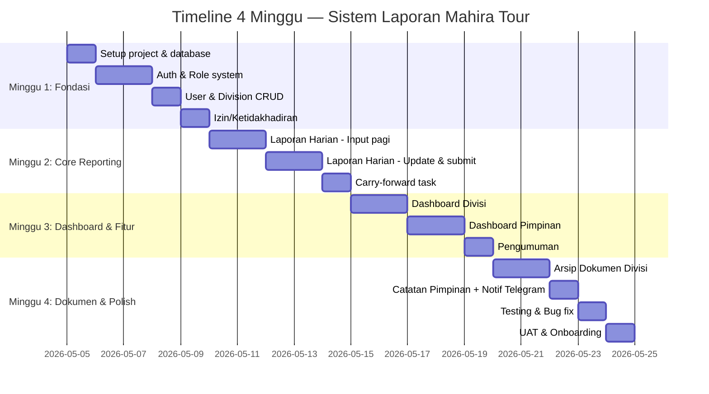

# 📋 Rekap Final v2 — Sistem Laporan Terintegrasi Mahira Tour

> **Tanggal Update**: 28 April 2026  
> **Status**: ✅ Desain final — siap development  
> **Timeline**: 1 bulan (4 minggu kerja)  
> **Developer**: Solo

---

## 1. Ringkasan Sistem

**Nama**: Integrated Reporting & Monitoring System  
**Tujuan**: Mendigitalkan pelaporan kerja + arsip dokumen + komunikasi internal Mahira Tour  
**User**: ~15-20 karyawan (beberapa divisi) + 2 pimpinan (direksi)  
**Akses**: Web app via HP (mobile-first) dan laptop

---

## 2. Daftar Fitur Lengkap

### 🟢 CORE — Tanpa ini sistem tidak berguna

| # | Fitur | Deskripsi |
|---|---|---|
| 1 | **Auth + Role** | Login email/password. 2 role: Staff & Direksi |
| 2 | **Manajemen User & Divisi** | CRUD user, assign ke divisi |
| 3 | **Laporan Harian** | Pagi: input task. Sore: update status + submit |
| 4 | **Dashboard Divisi** | Tiap divisi punya dashboard sendiri (laporan, arsip, statistik) |
| 5 | **Dashboard Pimpinan** | Overview semua divisi + drill-down ke masing-masing |
| 6 | **Notifikasi Telegram** | Reminder jam 16:00 "Jangan lupa submit laporan" |
| 7 | **Search & Filter** | Cari laporan by tanggal, divisi, status, keyword |
| 8 | **Izin/Ketidakhadiran** | Staff tandai izin → sistem tahu siapa yang memang tidak submit |

### 🟡 SHOULD HAVE — Meningkatkan value signifikan

| # | Fitur | Deskripsi |
|---|---|---|
| 9 | **Arsip Dokumen Divisi** | Upload, browse, download file per divisi. Direksi akses semua |
| 10 | **Papan Pengumuman** | Pimpinan broadcast info ke semua/per divisi. Status baca/belum |
| 11 | **Catatan Pimpinan** | Pimpinan beri feedback singkat di laporan staff |
| 12 | **Upload Bukti Foto** | Lampirkan foto di laporan harian (compress otomatis) |

### 🔵 NICE TO HAVE — Tambah polish, bisa ditunda

| # | Fitur | Deskripsi |
|---|---|---|
| 13 | **Weekly Digest Telegram** | Ringkasan mingguan otomatis ke pimpinan tiap Senin |
| 14 | **Pin Dokumen Penting** | Tandai dokumen penting → selalu muncul di atas |
| 15 | **Laporan Bulanan** | Auto-recap dari data harian + narasi manual staff |

---

## 3. Alur Kerja Harian di Perusahaan

### 🌅 PAGI (07:00 - 09:00) — Staff Mulai Hari

```
Staff buka web app di HP
         │
         ├─→ 📢 Cek Pengumuman
         │   "Ada pengumuman baru dari pimpinan: Rapat evaluasi Jumat jam 10"
         │   → Klik tandai sudah dibaca
         │
         ├─→ 📋 Buat Rencana Kerja Hari Ini
         │   Task 1: Follow-up jamaah Pak Ahmad        [prioritas: tinggi]
         │   Task 2: Kirim invoice ke hotel Madinah     [prioritas: tinggi]
         │   Task 3: Update brosur paket Desember       [prioritas: sedang]
         │   → Submit rencana kerja
         │
         ├─→ 📅 (Jika izin) Klik "Izin Hari Ini"
         │   Pilih alasan: Sakit / Cuti / Dinas Luar
         │   → Sistem otomatis: tidak kirim reminder, dashboard tampilkan "izin"
         │
         └─→ ⬅️ Task kemarin yang belum selesai otomatis muncul (carry-forward)
             "Task dari kemarin: Urus visa jamaah Bu Siti [belum selesai]"
             → Otomatis masuk ke rencana hari ini
```

### 🌤️ SIANG — Staff Kerja Normal

```
Staff bekerja seperti biasa
Tidak perlu buka sistem — fokus kerja

Jika ada dokumen penting yang perlu diarsipkan:
   → Buka menu "Arsip Dokumen"
   → Upload file (PDF/Excel/foto)
   → Beri judul & kategori
   → Tersimpan di arsip divisi
```

### 🌅 SORE (16:00) — Reminder & Submit Laporan

```
16:00  🤖 Telegram Bot kirim pesan:
       "Hai Pak Budi, jangan lupa submit laporan hari ini ya!"
       (Karyawan yang izin TIDAK dapat reminder)

16:00 - 17:00  Staff buka web app lagi
         │
         ├─→ 📋 Update Status Setiap Task
         │   Task 1: Follow-up jamaah Pak Ahmad     → ✅ Selesai
         │   Task 2: Kirim invoice hotel Madinah     → ✅ Selesai
         │   Task 3: Update brosur paket Desember    → 🔄 Dalam proses (lanjut besok)
         │
         ├─→ ➕ Tambah Task Baru (jika ada kerjaan mendadak)
         │   Task 4: Handle komplain jamaah Bu Rina  → ✅ Selesai
         │
         ├─→ 📷 Upload Bukti Foto (opsional)
         │   Foto invoice yang sudah dikirim
         │
         └─→ ✅ Klik "Submit Laporan"
             Sistem tampilkan: "✓ Laporan hari ini sudah terkirim!"
             → Notifikasi masuk ke Telegram pimpinan
```

### 🌙 MALAM — Pimpinan Review

```
Pimpinan buka web app (HP atau laptop)
         │
         ├─→ 📊 Dashboard Utama
         │   ┌────────────────────────────────────────────┐
         │   │ Status Hari Ini - Selasa, 28 April 2026    │
         │   │                                            │
         │   │ ✅ Operasional  — Sudah submit (3/3 task)  │
         │   │ ✅ Marketing    — Sudah submit (4/4 task)  │
         │   │ ⚠️ Keuangan    — Belum submit              │
         │   │ 📅 IT          — Izin sakit                │
         │   │                                            │
         │   │ Completion rate hari ini: 87%               │
         │   └────────────────────────────────────────────┘
         │
         ├─→ 🔍 Klik divisi "Operasional" → masuk dashboard divisi
         │   → Lihat detail laporan
         │   → Lihat arsip dokumen divisi
         │   → Beri catatan: "Bagus, lanjutkan follow-up jamaah besok"
         │
         ├─→ 📢 Post Pengumuman (jika perlu)
         │   "Reminder: Rapat evaluasi Jumat jam 10 di ruang meeting"
         │   Target: Semua divisi
         │   → Publish
         │
         └─→ 📂 Browse Arsip Dokumen (jika perlu)
             → Filter by divisi → Download file yang dibutuhkan
```

---

## 4. Alur Kerja Mingguan

```
Senin Pagi
    │
    ├─→ 🤖 (Otomatis) Weekly Digest via Telegram ke Pimpinan:
    │   "Ringkasan Minggu 21-25 April:
    │    • 5/5 hari submit: Operasional, Marketing
    │    • 4/5 hari submit: Keuangan (izin 1 hari)
    │    • Completion rate: 85%
    │    • 3 task carry-forward ke minggu ini"
    │
    └─→ Pimpinan review → tahu mana divisi yang perlu perhatian
```

---

## 5. Alur Kerja Bulanan

```
Akhir Bulan (tanggal 28-30)
    │
    ├─→ Sistem auto-generate rekap bulanan per divisi:
    │   • Total task: 87 planned, 74 completed (85%)
    │   • Hari submit: 20/22 hari kerja
    │   • Task paling sering carry-forward: "..."
    │
    ├─→ Staff tambah narasi:
    │   • Capaian bulan ini: [textarea]
    │   • Kendala: [textarea]
    │   • Rencana bulan depan: [textarea]
    │   → Submit
    │
    └─→ Pimpinan review & acknowledge
```

---

## 6. Gambaran Lengkap: Siapa Melihat Apa?

### Staff melihat:

| Menu | Isi |
|---|---|
| **Beranda** | Pengumuman terbaru + status laporan hari ini |
| **Laporan Saya** | Input task pagi, update sore, histori laporan |
| **Arsip Divisi** | Upload & browse dokumen divisi sendiri |
| **Izin** | Ajukan izin hari ini |
| **Profil** | Data diri, Telegram ID |

### Pimpinan melihat:

| Menu | Isi |
|---|---|
| **Dashboard** | Overview semua divisi (siapa submit, siapa belum, siapa izin) |
| **Per Divisi** | Drill-down: laporan + arsip + statistik divisi tertentu |
| **Pengumuman** | Buat & kelola pengumuman |
| **Arsip Semua** | Browse & download dokumen dari semua divisi |
| **Kelola User** | Tambah/edit staff & divisi |
| **Laporan Bulanan** | Review rekap bulanan semua divisi |

---

## 7. Database — Tabel Tambahan (dari diskusi baru)

Selain tabel yang sudah ada di rekap sebelumnya, tambah:

| Tabel Baru | Kolom Utama | Fungsi |
|---|---|---|
| `division_documents` | id, division_id, uploaded_by, title, category, file_path, file_size, file_type, description, is_pinned, created_at | Arsip dokumen per divisi |
| `announcements` | id, created_by, title, content, target_division_id (nullable = semua), created_at | Pengumuman dari pimpinan |
| `announcement_reads` | id, announcement_id, user_id, read_at | Tracking siapa yang sudah baca |
| `absences` | id, user_id, absence_date, type (sakit/cuti/dinas), reason, created_at | Izin/ketidakhadiran |
| `report_notes` | id, daily_report_id, noted_by, content, created_at | Catatan pimpinan di laporan |

---

## 8. Timeline Development — 4 Minggu



| Minggu | Fokus | Output |
|---|---|---|
| **1** | Fondasi | Login bisa, user bisa dibuat, staff bisa ajukan izin |
| **2** | Core | Staff bisa input task pagi, update sore, submit laporan |
| **3** | Dashboard | Pimpinan bisa monitor semua divisi, post pengumuman |
| **4** | Dokumen & Polish | Arsip dokumen, catatan pimpinan, testing, onboarding |

---

## 9. Tech Stack (Tidak Berubah)

| Layer | Teknologi |
|---|---|
| Frontend + Backend | Next.js 15 (App Router, TypeScript) |
| Database + Auth + Storage | Supabase (Free tier → upgrade jika perlu) |
| UI Components | shadcn/ui + Tailwind CSS |
| Notifikasi | Telegram Bot API |
| Hosting | Vercel (Hobby/Free) |
| Hosting | Vercel (Hobby/Free) |
| Domain | `laporan.mahiratour.id` (subdomain dari domain yang sudah dimiliki) |
| **Biaya** | **Rp 0/bulan** (mulai free tier, domain sudah ada) |

---

## 10. Struktur Halaman Aplikasi

```
app/
├── (auth)/
│   └── login/                    ← Halaman login
│
├── (staff)/
│   ├── beranda/                  ← Pengumuman + status hari ini
│   ├── laporan/
│   │   ├── buat/                 ← Input task pagi
│   │   ├── update/               ← Update status sore
│   │   └── riwayat/              ← Histori laporan
│   ├── arsip/                    ← Upload & browse dokumen divisi
│   ├── izin/                     ← Ajukan izin
│   ├── bulanan/                  ← Laporan bulanan
│   └── profil/                   ← Data diri
│
├── (direksi)/
│   ├── dashboard/                ← Overview semua divisi
│   ├── divisi/[id]/              ← Drill-down per divisi
│   │   ├── laporan/              ← Laporan divisi
│   │   └── arsip/                ← Arsip divisi
│   ├── pengumuman/               ← CRUD pengumuman
│   ├── arsip/                    ← Browse semua arsip
│   ├── kelola-user/              ← CRUD user & divisi
│   └── bulanan/                  ← Review laporan bulanan
│
└── api/
    └── telegram/                 ← Webhook reminder & digest
```

---

## 11. Akses Kontrol (RLS Summary)

| Data | Staff | Pimpinan |
|---|---|---|
| Laporan sendiri | ✅ Baca & tulis | ✅ Baca semua + catatan |
| Laporan divisi lain | ❌ | ✅ Baca semua |
| Arsip divisi sendiri | ✅ Upload & baca | ✅ Baca & download |
| Arsip divisi lain | ❌ | ✅ Baca & download |
| Pengumuman | ✅ Baca saja | ✅ Baca & buat |
| Izin | ✅ Ajukan sendiri | ✅ Lihat semua |
| Kelola user | ❌ | ✅ CRUD |

---

> [!IMPORTANT]
> **Dokumen ini adalah rekap final v2.** Semua fitur yang didiskusikan sudah tercakup:
> - ✅ Laporan harian (core)
> - ✅ Dashboard per divisi (baru)
> - ✅ Arsip dokumen divisi (baru)
> - ✅ Papan pengumuman (baru)
> - ✅ Izin/ketidakhadiran (baru)
> - ✅ Catatan pimpinan (baru)
> - ✅ Weekly digest (nice to have)
> - ✅ Pin dokumen (nice to have)
> - ✅ Laporan bulanan (nice to have)
>
> **Next step**: Mulai development Minggu 1 — setup project & fondasi.
